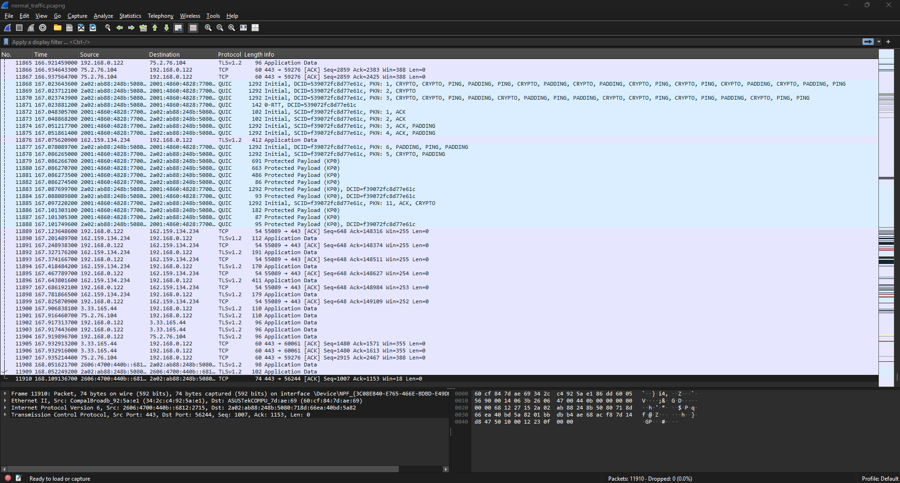

# PCAP Network Traffic Analyzer

## Overview

This project demonstrates the analysis of network traffic captured with Wireshark using Python and Scapy.

The tool processes packet capture (PCAP) files, identifies network protocols, analyzes communication patterns, and generates traffic reports for security monitoring and investigation purposes.

## Objectives

* Capture network traffic using Wireshark
* Analyze PCAP files using Python
* Identify protocol distribution
* Identify top source IP addresses
* Identify top destination IP addresses
* Generate traffic analysis reports

## Technologies Used

* Python
* Scapy
* Pandas
* Wireshark

## Architecture

Network Traffic

↓

Wireshark Capture

↓

PCAP File

↓

Python Analyzer

↓

Traffic Report

## Features

* Protocol Analysis
* Source IP Analysis
* Destination IP Analysis
* CSV Report Generation

## Screenshots

### Wireshark Capture

### Analyzer Output

## Skills Demonstrated

* Network Traffic Analysis
* Packet Analysis
* Wireshark
* Python Automation
* Security Monitoring
* Data Analysis

## Lessons Learned

This project provided hands-on experience with packet capture analysis, network protocol identification, and automated reporting using Python. It reinforced fundamental networking concepts and security monitoring techniques used by SOC analysts.
